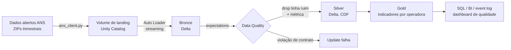

# Medalhão ANS em Databricks

Pipeline em arquitetura medalhão sobre as demonstrações contábeis das
operadoras de saúde (dados abertos da ANS), construído com o que o Databricks
tem de nativo: **Delta Live Tables**, **Auto Loader**, **expectations** como
Data Quality Monitoring e **Unity Catalog**, tudo implantável como código via
**Asset Bundles**. Roda no Databricks Free Edition (serverless).

Complementa o [de-lakehouse-bcb](https://github.com/Felipedb/de-lakehouse-bcb):
lá o stack é open source (Iceberg, Airflow, dbt); aqui é a plataforma
gerenciada resolvendo os mesmos problemas com menos código.

## Arquitetura



| Camada | Mecanismo | Data Quality |
| --- | --- | --- |
| Bronze | Auto Loader (cloudFiles), streaming | nenhum: dado como recebido |
| Silver | tipagem, dedup por chave de negócio | `expect_all_or_drop` + `expect_or_fail` |
| Gold | agregação por operadora e competência | herdada da silver |

## Como rodar

```bash
pip install -r requirements-dev.txt && pytest      # testes locais

# baixar um trimestre para a landing (exemplo)
python -c "
from pathlib import Path
from src.ingestion.ans_client import Competencia, baixar_trimestre
baixar_trimestre(Competencia(2024, 1), Path('dados'))"

databricks bundle validate                          # valida o pipeline como código
databricks bundle deploy -t dev                     # implanta no workspace
```

O dashboard de qualidade sai do event log do próprio DLT:
`resources/quality_dashboard.sql`.

## Decisões de arquitetura

- [0001 — DLT em vez de jobs Spark orquestrados à mão](docs/adr/0001-dlt-em-vez-de-jobs.md)
- [0002 — Por que o dado da ANS](docs/adr/0002-dado-ans.md)

## O que este repositório demonstra

Data Quality declarativo com métrica automática (as expectations viram
linhas consultáveis no event log, sem framework próprio), ingestão incremental
de arquivos com Auto Loader sem controle manual de estado, tratamento de dado
público sujo de verdade (latin-1, decimal com vírgula, layout que varia entre
anos), e pipeline inteiro como código com deploy reprodutível por Asset Bundle.
